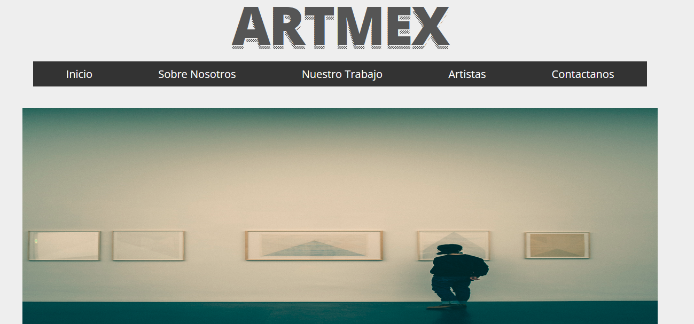
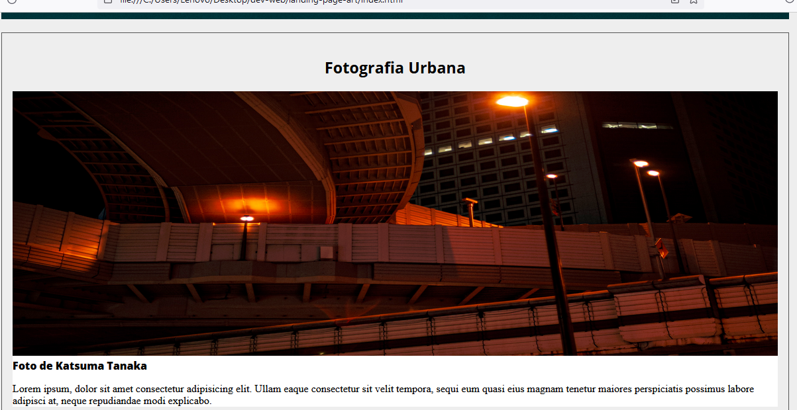
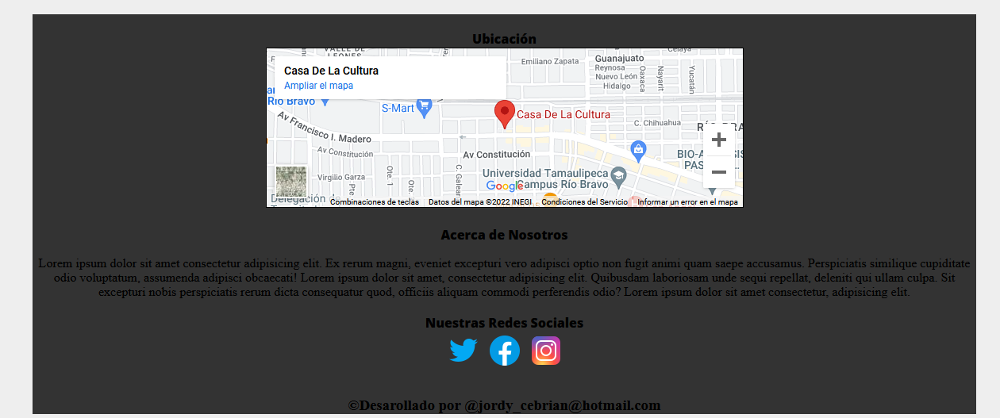

# Pagina Estática | ArtMex

## Herramientas
* Html
* Css(flexbox, mediaquerys)

## Descripción
* En esta Página web qur solo es de vista, me sirvió
  para practicar los conocimientos y reforzarlos, además de aprender nuevas cosas, como lo son la creación del efecto sombra del texto, el uso de flexbox para el responsive, lo que me tomo mucho tiempo aplicar, entre otras cosas.

## Imágenes de la pagina

#

#

